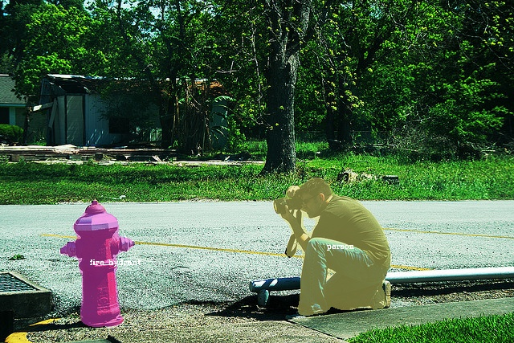

# Notes
[CondInst source code : https://github.com/aim-uofa/AdelaiDet](https://github.com/aim-uofa/AdelaiDet)
[SOLOv2 source code : https://github.com/WXinlong/SOLO](https://github.com/WXinlong/SOLO)
The model with ResNet-50 backbone(1x) achieves 28.7 mAP on COCO val2017 set.
- 4 gpu due to resource constraints
- NO FCOS bbox branch and centerness(Maybe because of this mAP drops)
- NO MS
- NO rel.coord
- NO auxiliary semantic segmentation
- Using matrix nms proposed by SOLOv2

If you need model, please contact me.
# Environments (myself)
- python 3.7
- pytorch 1.1.0
- [mmdetection v1.2.0](https://github.com/open-mmlab/mmdetection/blob/v1.2.0/docs/INSTALL.md) (please see the LINK for installation)
- mmcv 0.3.1

# Train
```python
# 4 gpu
./tools/dist_train.sh configs/condinst/condinst_r50_caffe_fpn_gn_1x_4gpu.py  4

# single gpu
python tools/train.py configs/condinst/condinst_r50_caffe_fpn_gn_1x_4gpu.py
```

# Eval
```python
python tools/test.py configs/condinst/condinst_r50_caffe_fpn_gn_1x_4gpu.py YOUR_CHECKPOINT_DIR  --out condinst.pkl --eval segm
```

# Visualization
```python
python tools/detect.py
```
some results you can see in 'outdata/'



